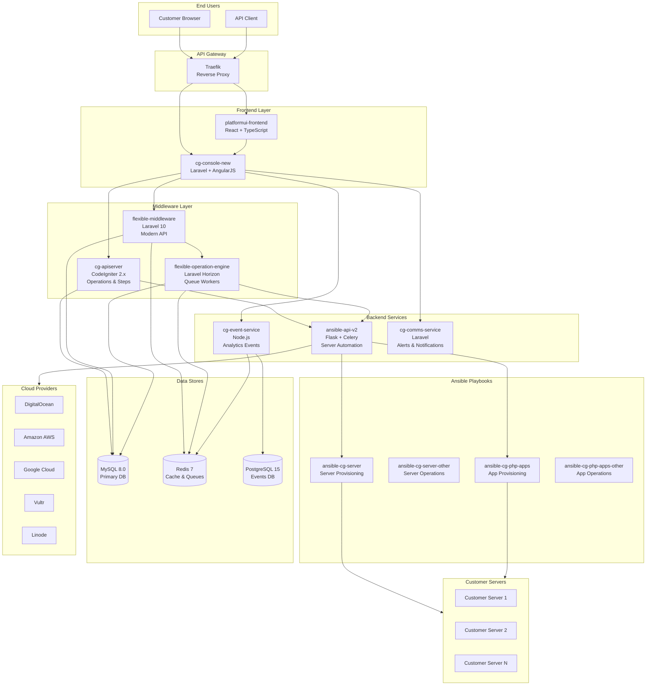
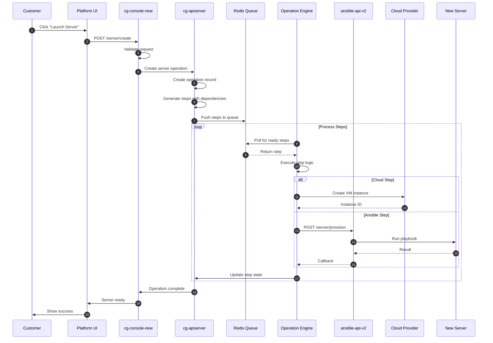
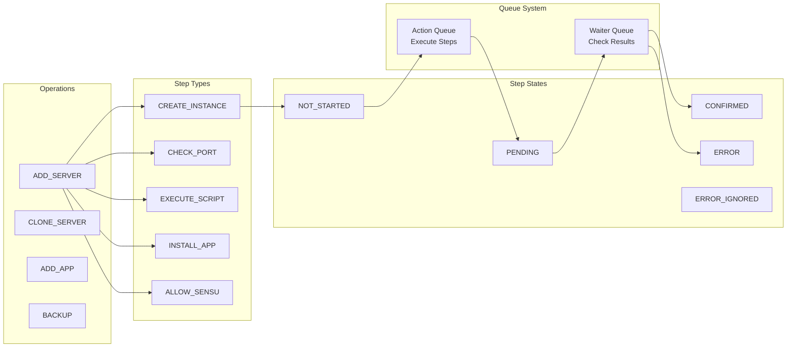
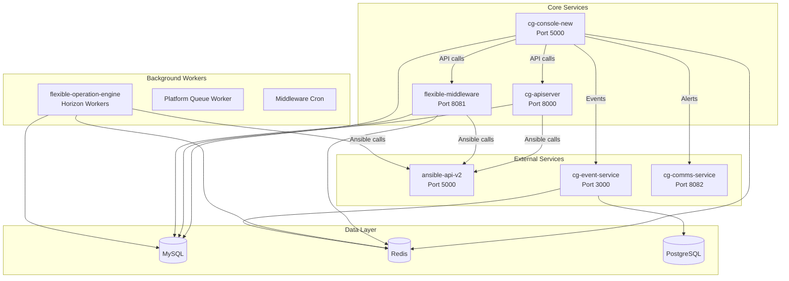
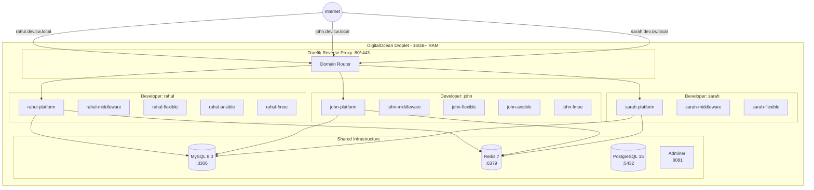
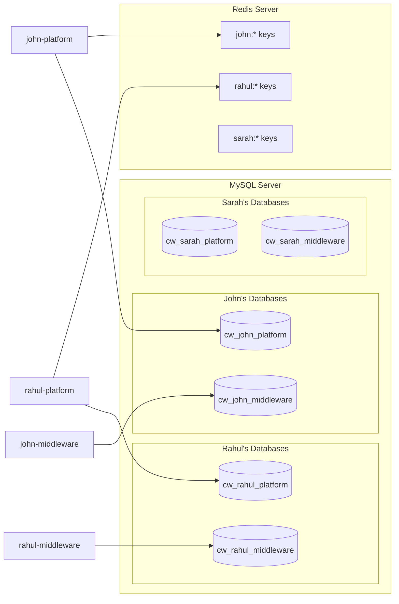
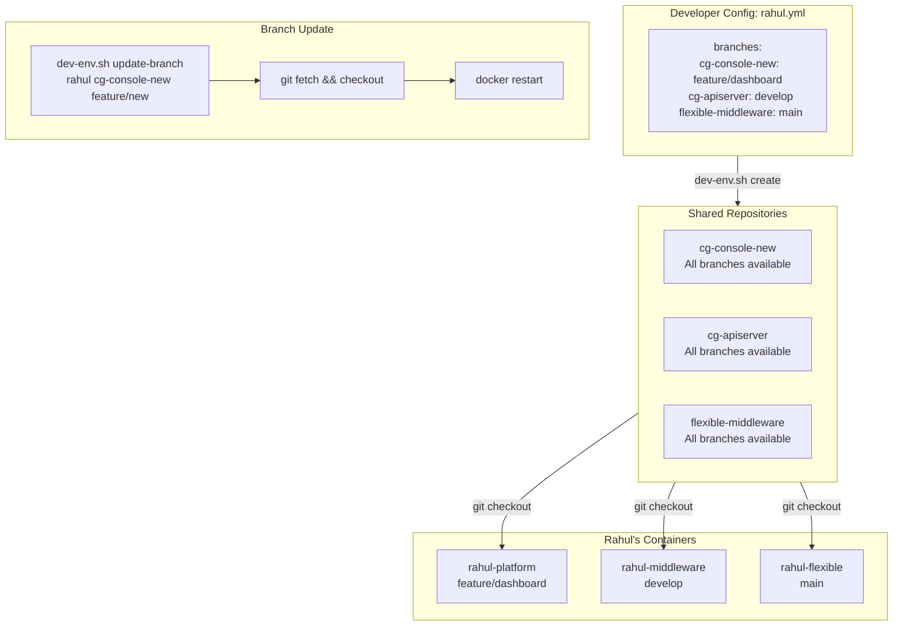
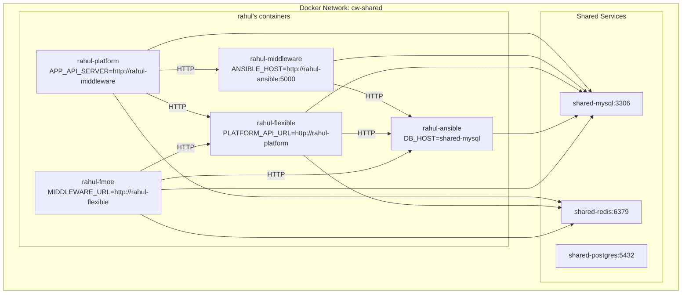

# Cloudways Developer Environment

A Docker-based multi-developer environment that replicates the full Cloudways platform architecture, allowing each developer to have isolated services with their own branch configurations on a shared host.

---

## Cloudways Platform Architecture

### High-Level System Overview



---

### Request Flow: Server Provisioning



---

### Operation & Step Processing



---

### Service Dependencies



---

## Developer Environment Architecture

### Multi-Developer Setup



---

### Database Isolation Strategy



---

### Branch Management Flow



---

### Container Communication



---

## Repository Overview

| Repository | Technology | Purpose |
|------------|------------|---------|
| `cg-console-new` | Laravel 5.2 + AngularJS | Main platform backend & legacy UI |
| `cg-apiserver` | CodeIgniter 2.x | Middleware - operations & cloud integrations |
| `flexible-middleware` | Laravel 10 | Modern API layer |
| `flexible-operation-engine` | Laravel + Horizon | Background job processing |
| `ansible-api-v2` | Python Flask + Celery | Ansible automation API |
| `cg-event-service` | Node.js + Express | Analytics event processing |
| `cg-comms-service` | Laravel/Lumen | Alerts & notifications |
| `platformui-frontend` | React + TypeScript | Modern React UI |
| `ansible-cg-server` | Ansible Playbooks | Server provisioning roles |
| `ansible-cg-php-apps` | Ansible Playbooks | Application provisioning |

---

## Quick Start

```bash
# 1. Setup the droplet (run on fresh DigitalOcean droplet)
sudo ./scripts/setup-droplet.sh

# 2. Generate deploy key for GitHub
sudo ./scripts/generate-deploy-key.sh

# 3. Add the deploy key to GitHub (see output from step 2)

# 4. Clone all repositories
./scripts/clone-repos.sh

# 5. Start shared services (MySQL, Redis, PostgreSQL, Traefik)
docker compose -f shared/docker-compose.yml up -d

# 6. Create your developer environment
./scripts/dev-env.sh create <your-name>
```

---

## Directory Structure

```
/opt/cloudways-dev/
├── keys/                           # SSH deploy keys
│   ├── github_deploy_key
│   └── config
├── developers/                     # Per-developer config files
│   ├── rahul.yml
│   └── john.yml
├── repos/                          # Cloned repositories (shared)
│   ├── cg-console-new/
│   ├── cg-apiserver/
│   ├── flexible-middleware/
│   └── ...
├── shared/                         # Shared infrastructure
│   ├── docker-compose.yml
│   ├── mysql-init/
│   └── postgres-init/
├── scripts/                        # CLI tools
│   ├── dev-env.sh                  # Main CLI
│   ├── setup-droplet.sh
│   ├── generate-deploy-key.sh
│   └── clone-repos.sh
├── docker-compose.template.yml     # Service template
└── docker-compose.<developer>.yml  # Generated per developer
```

---

## CLI Commands

| Command | Description |
|---------|-------------|
| `./scripts/dev-env.sh create <name>` | Create new developer environment |
| `./scripts/dev-env.sh destroy <name>` | Remove developer environment |
| `./scripts/dev-env.sh update-branch <name> <repo> <branch>` | Update branch for a repo |
| `./scripts/dev-env.sh pull <name>` | Pull latest code for all repos |
| `./scripts/dev-env.sh status [name]` | Show environment status |
| `./scripts/dev-env.sh logs <name> [service]` | Show container logs |
| `./scripts/dev-env.sh restart <name> [service]` | Restart services |
| `./scripts/dev-env.sh exec <name> <service> <cmd>` | Execute command in container |

---

## Developer Configuration

Each developer has a YAML config file in `developers/`:

```yaml
developer: rahul
email: rahul@cloudways.com

branches:
  cg-console-new: feature/new-dashboard
  cg-apiserver: develop
  flexible-middleware: main
  flexible-operation-engine: main
  ansible-api-v2: master
  cg-event-service: main
  cg-comms-service: main

environment:
  APP_DEBUG: "true"
```

---

## Access URLs

| Service | URL |
|---------|-----|
| Platform UI | `http://<dev>.dev.cw.local` |
| API | `http://api-<dev>.dev.cw.local` |
| Flexible MW | `http://flexible-<dev>.dev.cw.local` |
| Traefik Dashboard | `http://DROPLET_IP:8080` |
| Adminer (DB) | `http://DROPLET_IP:8081` |

Add to your local `/etc/hosts`:
```
DROPLET_IP  rahul.dev.cw.local api-rahul.dev.cw.local flexible-rahul.dev.cw.local
```

---

## Requirements

- **DigitalOcean Droplet**: 16GB+ RAM recommended
- **Docker**: 20.10+
- **Docker Compose**: v2
- **yq**: YAML processor
- **jq**: JSON processor
